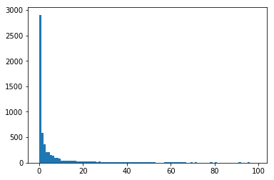

# arxiv-scraping
let's scrape arxiv papers by python.


Number of citations are acquired from semantic scholar.


## usage

python arxiv_scrape.py


## plot and analyze.

most arxiv papers have citations == 0.

This is kind of sad.



Out of 6000 acquired papers, almost half of them have 0 citations.


80% of the papers have less than 10 citations (so don't be depressed if you don't get any citations! I guess it's pretty normal.)


This is the data I used for the histogram.

```python
matplotlib.pyplt.hist(cite, range=(0, 100))

cite=[2.904e+03, 5.870e+02, 3.660e+02, 2.100e+02, 2.090e+02, 1.450e+02,
        1.360e+02, 9.200e+01, 9.200e+01, 7.600e+01, 4.400e+01, 4.300e+01,
        4.100e+01, 4.300e+01, 3.700e+01, 3.500e+01, 3.600e+01, 3.200e+01,
        2.200e+01, 3.000e+01, 3.200e+01, 2.500e+01, 2.500e+01, 2.300e+01,
        2.100e+01, 2.200e+01, 1.500e+01, 2.100e+01, 1.200e+01, 1.800e+01,
        1.700e+01, 1.300e+01, 1.100e+01, 1.500e+01, 1.000e+01, 1.700e+01,
        1.500e+01, 1.000e+01, 9.000e+00, 1.600e+01, 8.000e+00, 5.000e+00,
        8.000e+00, 7.000e+00, 8.000e+00, 5.000e+00, 6.000e+00, 7.000e+00,
        9.000e+00, 6.000e+00, 9.000e+00, 5.000e+00, 8.000e+00, 2.000e+00,
        3.000e+00, 3.000e+00, 3.000e+00, 6.000e+00, 6.000e+00, 5.000e+00,
        7.000e+00, 9.000e+00, 9.000e+00, 7.000e+00, 5.000e+00, 1.000e+01,
        5.000e+00, 3.000e+00, 3.000e+00, 5.000e+00, 3.000e+00, 5.000e+00,
        2.000e+00, 4.000e+00, 1.000e+00, 2.000e+00, 2.000e+00, 4.000e+00,
        6.000e+00, 2.000e+00, 5.000e+00, 0.000e+00, 1.000e+00, 4.000e+00,
        4.000e+00, 3.000e+00, 3.000e+00, 1.000e+00, 2.000e+00, 3.000e+00,
        1.000e+00, 1.000e+01, 1.000e+00, 3.000e+00, 2.000e+00, 5.000e+00,
        2.000e+00, 3.000e+00, 1.000e+00]
```

